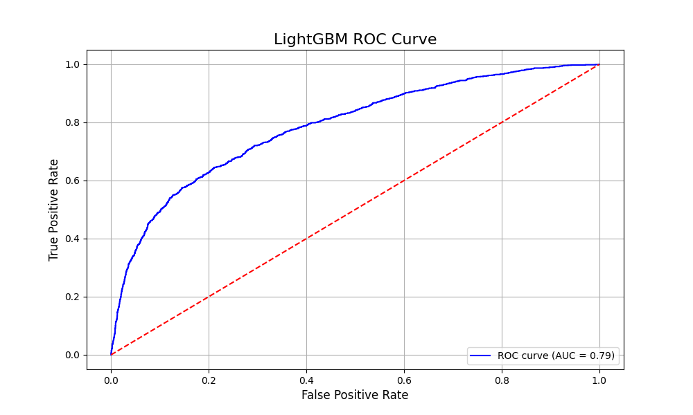
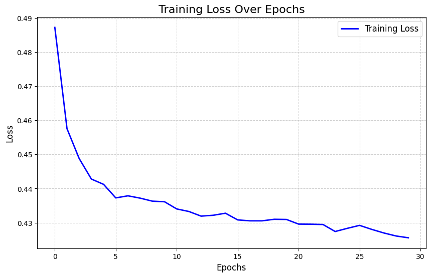
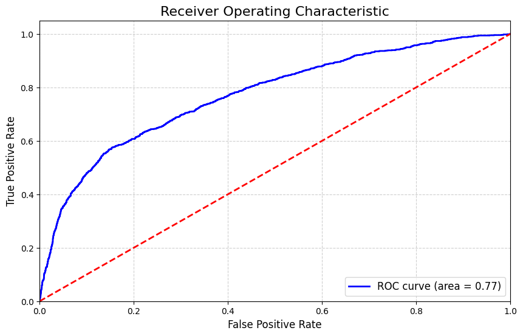

# Credit Default Prediction with Neural Networks and LightGBM

## Project Overview

This project aims to predict **credit default** using two powerful machine learning models:

1. **Neural Network** (implemented in **PyTorch**): A feed-forward neural network designed to classify whether a customer will default on their credit payment or not.
2. **LightGBM** (Light Gradient Boosting Machine): A highly efficient, fast, and accurate implementation of gradient boosting that excels with tabular data, making it an excellent choice for classification tasks like credit default prediction. LightGBM's boosting approach, combined with its ability to handle large datasets efficiently, is used here to predict credit default with strong accuracy and quick convergence.

The project includes:

- **Exploratory Data Analysis (EDA)**: Understanding the data and its features.
- **Model Building**: Training a Neural Network and LightGBM model for classification.
- **Model Evaluation**: Assessing the models' performance using accuracy, precision, and ROC-AUC.
- **Visualization**: Training loss over epochs and ROC curves for both models.

## Project Structure


## Project Structure

## Setup Instructions

### **Step 1: Install Dependencies**

First, ensure you have all the necessary dependencies installed. You can install them using the `requirements.txt` file or manually as listed below.

#### Option 1: Install via `requirements.txt` (Recommended)

```
pip install -r requirements.txt

kaggle datasets download -d uciml/default-of-credit-card-clients-dataset -p data/
unzip data/default-of-credit-card-clients-dataset.zip -d data/
mv data/UCI_Credit_Card.csv data/credit_card_default.csv
```

## Data description

The Credit Card Default dataset contains data on 30,000 customers, including information on credit limit, payment history, bill amounts, and other variables, to predict whether a customer will default on their payment.

### Key Features:
- LIMIT_BAL: Credit limit for each customer.
- AGE: Age of the customer.
- BILL_AMT1: Amount of bill statement for the first month.
- PAY_AMT1: Amount paid in the first month.
- SEX: Gender of the customer.
- EDUCATION: Education level of the customer.
- MARRIAGE: Marital status of the customer.
- default.payment.next.month: Target variable indicating whether the customer defaulted (1) or not (0).


## Running the project for LightGBM Model Training and Evaluation

### Step 1: Train LightGBM Model

To train the LightGBM model, run the following command:
```
python scripts/lightgbm_model.py
```


This will:
- Preprocess the data.
- Train the LightGBM model on the training set.
- Save the trained model to the `trained_models/` directory.
- Plot and save the training loss curve.

### Step 2: Evaluate LightGBM Model

Once the LightGBM model is trained, it will automatically be evaluated and the following will be printed:

- **Accuracy**: How well the model predicts default.
- **Precision**: The proportion of positive predictions that are correct.
- **ROC-AUC**: The area under the ROC curve, which measures the overall performance of the classifier.

### Results for LightGBM


2. **ROC Curve** for LightGBM:

The ROC curve illustrates the tradeoff between the true positive rate and the false positive rate. The **ROC-AUC score** quantifies how well the model distinguishes between defaulting and non-defaulting customers.




## Running in the project for Neural networks

### Step 1. Run preprocessing and train model
```
python main.py
```
This will:

- Preprocess the data.
- Train the model on the training set.
- Save the trained model in the trained_models/ directory.

### Step 2: Evaluate the Model

```
python scripts/evaluate_model.py
```

This will:

- Load the trained model.
- Evaluate its accuracy, precision, and ROC-AUC.
- Plot the ROC Curve.


## Results

### 1. Training Loss Plot

This plot shows the loss over time as the model trains. The loss decreases steadily, indicating that the model is learning from the data.



### 2. ROC Curve

The **ROC Curve** shows the performance of the model. The **ROC-AUC score** quantifies how well the model distinguishes between defaulting and non-defaulting customers. The higher the AUC, the better the model's performance.

